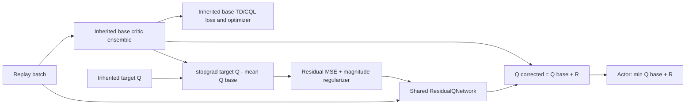

# Lancet Implementation

Lancet v1 is a minimal subclass of `WSRL`, registered as a separate off2on
algorithm. It does not copy the WSRL runner or replace the base SAC/Cal-QL
critic machinery.

## Source ownership

- `rl_garden/algorithms/lancet.py`: residual network and update overrides.
- `rl_garden/training/off2on/lancet.py`: Args, builder, registry call.
- `rl_garden/algorithms/__init__.py`: public exports.
- `configs/off2on/lancet_antmaze_medium_play_v2.yaml`: formal-scale template,
  not executed in this work.
- `configs/off2on/lancet_antmaze_medium_play_smoke.yaml`: tiny wiring check.

## Exact v1 behavior

- Base critic: inherited WSRL ensemble, normally updated by the inherited
  TD/CQL loss. Lancet does not replace that optimizer step.
- Target critic/TD target: inherited SAC target path; the residual is not added
  to the bootstrap target.
- Residual: one shared MLP `R_phi(state, action) -> [batch, 1]`, added to every
  ensemble member to avoid multiplying capacity by critic count.
- Residual target: after the base critic step,
  `stopgrad(target_q - mean_i(Q_base_i))`.
- Residual optimization: MSE TD fit plus squared-magnitude regularization,
  using its own optimizer. Audit coverage proves parameters change after a
  step.
- Actor: inherited sampling/entropy term, but the Q term is
  `min_i(Q_base_i) + R_phi`. Only the actor optimizer steps in this phase;
  residual ownership remains with the residual optimizer.
- Corrected-Q interface: returns `[n_critics, batch, 1]`.

## Logging and checkpoints

Metrics include residual mean/absolute mean/std, total residual loss, TD fit,
U-variation placeholder, regularizer, residual/Q ratio, and TD-error mean/
absolute mean. Tags are written under `lancet/*` and `critic/*`.

The residual optimizer is added through `_optimizer_names`; residual weights
are stored under extra checkpoint state, and Lancet hyperparameters are stored
as checkpoint metadata. Unit/audit tests cover save/load equality and presence
of both residual weights and optimizer state.

## U-variation

`lambda_u_variation` defaults to `0`. Its mathematics is not defined in the
project, so the implementation returns zero only in that mode and rejects any
nonzero value. No surrogate formula was invented by the Agent.
