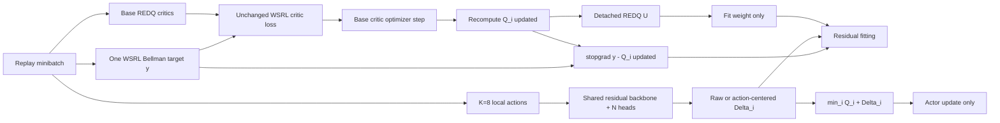

# Lancet implementation

## Naming

Git history confirms one prior executable: the shared scalar Raw Residual
scaffold. It is now **Lancet V1**, implemented as `LancetV1` and registered as
`lancet_v1`. There is no separately evidenced Lancet V2 executable.

The current formal method is simply **Lancet**:

- class: `rl_garden.algorithms.lancet.Lancet`
- residual module: `ResidualEnsemble`
- registry: `lancet`
- variants: `raw | centered | lancet`
- config: `configs/off2on/lancet_antmaze_medium_play_v2.yaml`

## Architecture and update order



The base target is computed once and reused after the base optimizer step.
Lancet never resamples a stochastic target in the residual hook. Target
critics never include residual correction.

## Residual and local actions

`ResidualEnsemble` uses a shared two-layer 128-wide LayerNorm MLP and one
output head per REDQ critic. The final output layer is exactly zero initialized,
so a WSRL checkpoint fork starts with `Q_use == Q_base`.

For each replay state the local set is:

1. replay action;
2. deterministic current actor action;
3. six Gaussian perturbations around that actor action.

Noise standard deviation is 0.1 of action half-range and actions are clipped
to environment bounds. Residual tensors are `[N,B,K,1]`. Centered/Lancet use
`Delta=R-mean_action(R)`; Raw uses `Delta=R` while retaining the same local
machinery.

## Actor gradient semantics

The actor uses the full repaired ensemble:

```text
Q_actor = min_i(Q_i(s,a_actor) + Delta_i(s,a_actor))
Delta_actor = R(s,a_actor) - stopgrad(mean_local R)
```

`R(s,a_actor)` keeps its action gradient. Critic and residual parameters are
temporarily frozen, so the actor optimizer changes only actor parameters.

## Residual loss and U weighting

Each head fits its corresponding post-base-update TD residual:

```text
L_fit = mean_i,b w_b (Delta_observed_i,b - stopgrad(y-Q_i_updated))^2
L_small = mean_i,b,k Delta_local^2
L_residual = L_fit + 1e-4 L_small
```

Raw/Centered use `w=1`. Lancet uses detached action-dependent REDQ
disagreement:

```text
w = clip(1 + U/(EMA(U)+1e-8), 1, 3)
```

EMA decay is .99 and the first active batch initializes EMA to its exact mean.
U is not a loss or prediction target and never changes the base critic.

## Lifecycle

- offline: residual inactive;
- first 5k online warmup steps: inactive;
- post-warmup adaptation steps `[0,50000)`: lambda=1, update/use correction;
- adaptation step `>=50000`: lambda=0, residual updates stop, actor uses base Q.

The first update after warmup defines `adaptation_step=0`.

## Checkpoint and logging

Inherited state contains actor, base/target critics, alpha, optimizers, and
global counters. Lancet additionally saves residual weights/optimizer, variant,
U EMA, adaptation start/update count, and local-action RNG. A WSRL checkpoint
loads as a zero-correction fork. Ambiguous old Lancet V1 residual state is
rejected with a migration error.

Metrics include residual/Delta moments and loss, per-critic post-update TD
residual, U/EMA/weight, base/corrected Q, correction ratios, lambda,
adaptation step, and residual update count.

## Historical implementation

Lancet V1 remains in `rl_garden/algorithms/lancet_v1.py` solely for historical
checkpoint/config reproduction. It uses one shared scalar residual,
`y-mean_i(Q_i)`, no centering, random nonzero output initialization, and a
legacy disabled `lambda_u_variation` placeholder. It is not a formal cell in
the current benchmark.

## Authoritative design references

1. `docs/design/Lancet_v3_技术实现思路与理论证明.pdf` (supplied theory source)
2. `docs/design/lancet-implementation.md`
3. `docs/design/lancet-theory-code-alignment.md`
4. `experiments/protocols/antmaze_wsrl_lancet.md`
