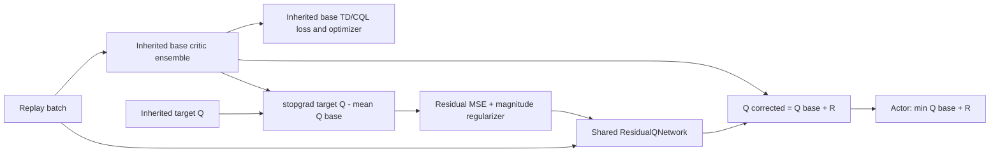

# Lancet Implementation Status

## Status split

The repository currently contains two different levels of Lancet material:

- **Executable and tested:** Legacy Lancet-TD, the shared scalar raw-residual
  scaffold in `rl_garden/algorithms/lancet.py`.
- **Designed, not implemented:** Lancet v3, specified in
  `docs/design/lancet-v3-implementation.md` and checked against the current
  code in `docs/design/lancet-v3-theory-code-alignment.md`.

Do not call the current executable class full Lancet or Lancet v3.

## Legacy Lancet-TD

Legacy Lancet-TD is a minimal subclass of `WSRL`, registered as a separate
off2on algorithm. It does not copy the WSRL runner or replace the base
SAC/Cal-QL critic machinery.



### Source ownership

- `rl_garden/algorithms/lancet.py`: legacy residual network and overrides.
- `rl_garden/training/off2on/lancet.py`: legacy Args, builder, registry call.
- `configs/off2on/lancet_antmaze_medium_play_v2.yaml`: legacy full-scale
  template, never executed as a formal benchmark.
- `configs/off2on/lancet_antmaze_medium_play_smoke.yaml`: historical tiny
  wiring check.

### Exact legacy behavior

- Base critic and target: inherited WSRL paths.
- Residual: one shared MLP `R_phi(state, action) -> [batch,1]`, added to every
  critic.
- Target: `stopgrad(target_q - mean_i(Q_base_i))`, recomputed after the base
  update.
- Actor: `min_i(Q_base_i) + R_phi`.
- Regularizer: squared magnitude of raw R on the observed action.
- Initialization: default nonzero linear initialization.
- Phase behavior: the hook is not explicitly restricted to post-warmup online
  updates.

The residual optimizer and weights are checkpointed. Existing unit/audit tests
verify construction, finite update, parameter change, registry, and reload.

### Legacy U behavior

`lambda_u_variation` defaults to `0`. The legacy implementation rejects a
nonzero value. This old placeholder must not be carried into v3.

## Planned Lancet v3

V3 replaces the legacy correction design:

```text
WSRL base critic/target (unchanged)
  + shared residual backbone with one head per REDQ critic
  + K=8 policy-local actions
  + per-head action centering
  + per-head observed TD-residual supervision
  + detached REDQ disagreement used only as fitting weight
  -> actor uses min_i(Q_i + lambda(t) Delta_i)
```

The output heads are exact-zero initialized. Residual fitting is disabled
offline and during WSRL warmup. A linear 50k post-warmup schedule decays the
actor-facing correction from one to zero. U is mathematically defined as an
action-dependent ensemble-disagreement weight, not an independent loss.

Authoritative design entry points:

1. `docs/design/Lancet_v3_技术实现思路与理论证明.pdf`
2. `docs/design/lancet-v3-implementation.md`
3. `docs/design/lancet-v3-theory-code-alignment.md`

No Lancet v3 algorithm code, smoke, pilot, or formal result exists yet.
